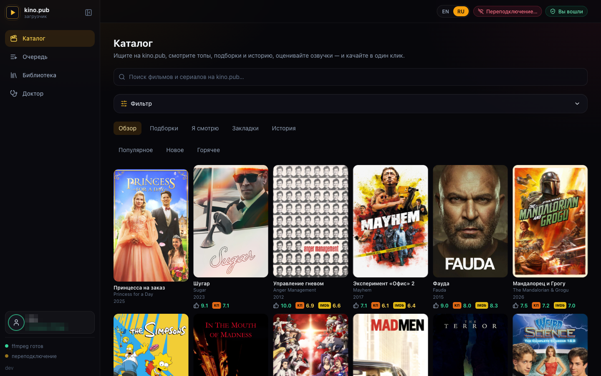
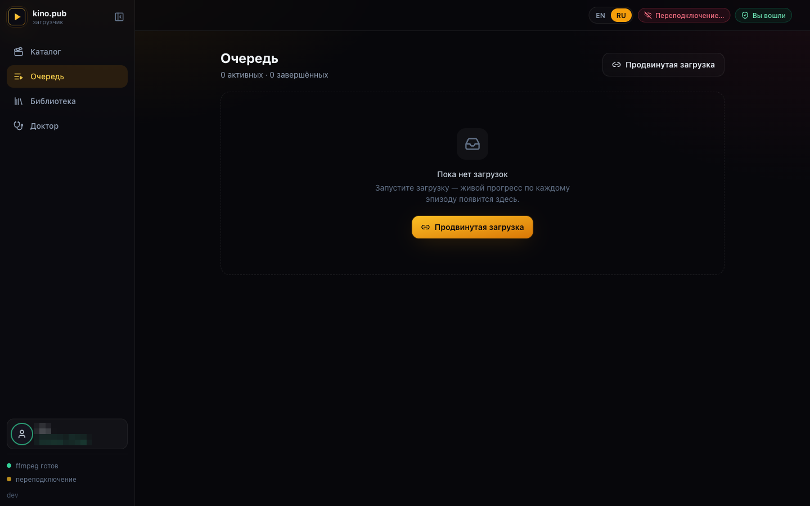
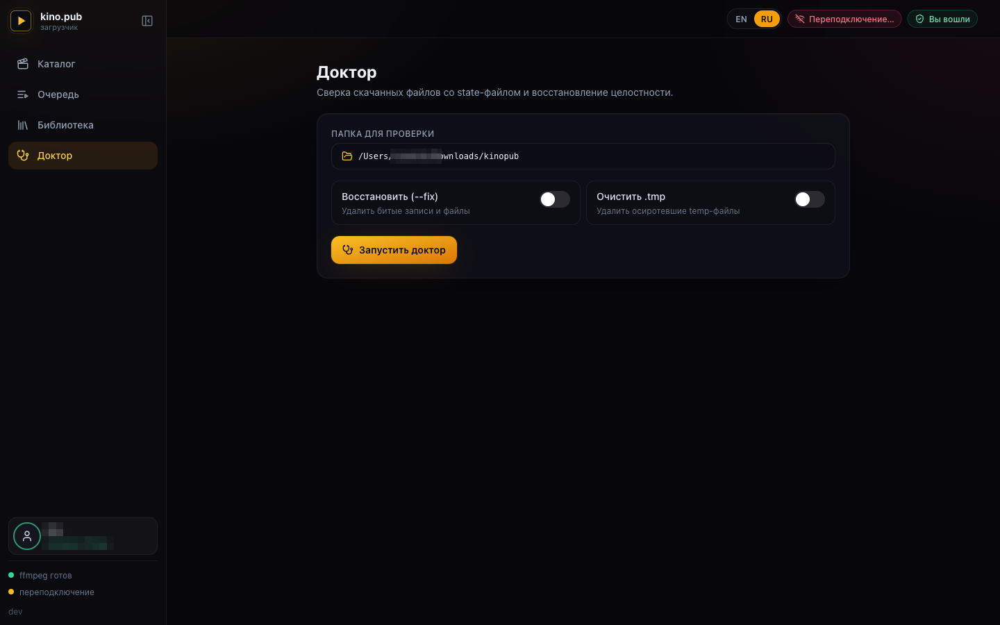
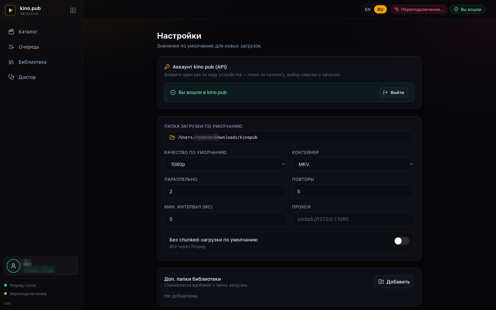

<p align="right"><a href="README.md">Русский</a> · <b>English</b></p>

# kino.pub downloader · GUI

**An app for downloading from [kino.pub](https://kino.pub), with a real interface.** Run it and it opens as a browser tab. Browse the catalog, preview a title right in the player, and download — movies and whole series, with every audio track and subtitle. While it downloads you see per-episode progress: speed and how much is left.

You sign in once, with a short device code. Nothing heavy under it — a single file, no Electron, no Node (a Go server with the React UI built in). Run it and you're set.

<p align="center">
  
</p>

<p align="center">
  
  
  
  
  
</p>

---

## Highlights

- 🎬 **Catalog browser** — search, tops, collections (подборки), genre/country filters, year and IMDb/Kinopoisk rating ranges, your watch history and "continue watching", and per-title detail with plot, cast, ratings and the full season/episode tree.
- ▶️ **Built-in player** — preview any title right in the app before you download it. The stream goes through the app itself, so there's nothing to set up in the browser.
- 🎬 **Full-fidelity downloads** — every audio track, every subtitle, whole multi-season series — picked from the catalog or pasted as a direct link.
- ⚡ **Live progress** — per-episode and per-track percentages, speed, and ETA — all updating in real time.
- 🔊 **Pick your dubs** — choose which voiceovers to keep right on the title page (remembered for next time) or in a timed picker when downloading from a link; your choice is generalized across episodes.
- 🩺 **Doctor** — verify downloads against the state file and repair inconsistencies, with a readable report.
- 📚 **Library** — browse what you've already downloaded, with sizes, resolutions and missing-file detection; open a finished file or reveal its folder.
- 🔐 **Sign in once** — a short device-code login; tokens are stored encrypted and machine-bound. Local features (Library, Doctor, Settings) work without signing in.
- 🌍 **Bilingual** — English & Russian, switchable in one click (remembered between sessions).
- 📦 **Single binary** — the UI is embedded; self-updates from GitHub releases.

## Screenshots

| Catalog browser | Live queue |
| --- | --- |
|  |  |

| Doctor | Settings |
| --- | --- |
|  |  |

---

## Requirements

- **ffmpeg** — the app uses it to merge video, audio and subtitles into one file. If it's installed (on your `PATH`), the app picks it up on its own; the Settings page shows a green or red check for `ffmpeg` and `ffprobe`.
  ```bash
  brew install ffmpeg          # macOS
  sudo apt install ffmpeg      # Debian/Ubuntu
  ```
  ```powershell
  winget install Gyan.FFmpeg   # Windows (or: choco install ffmpeg / scoop install ffmpeg)
  ```
  On Windows, make sure `ffmpeg.exe` and `ffprobe.exe` are on your `PATH` (the package managers above do this) — the Settings page confirms both are found.

  **Don't want to install it by hand?** If ffmpeg is missing, hit **Settings → System → Install ffmpeg** (the same button is on the Download page) — the app downloads a ready-made build for your system and uses it from then on. Nothing is written into the system, no admin rights needed.
- A browser (the app opens in whatever is your default).
- A kino.pub account with an active subscription — without it there's no catalog, no playback, no downloads.

## Install & run

**Prebuilt clients for every major platform** — grab one from the [releases page](https://github.com/ZioSHik/kinopub-gui/releases):

- 🍎 **macOS** — `.dmg` menu-bar app + standalone binaries, Apple Silicon (`arm64`) and Intel (`amd64`)
- 🪟 **Windows** — `x64` (`amd64`) executable, no console window and an embedded icon
- 🐧 **Linux** — `x64` (`amd64`, with a system-tray icon; also an `AppImage`) and `ARM64`
- 🤖 **Android** — `ARM64` (no native tray, web UI as usual; runs under Termux)

Same single binary everywhere — the React UI is embedded, so there is nothing else to install.

### Option A — download a release binary

Grab `kinopub-gui-*` for your platform from the [releases page](https://github.com/ZioSHik/kinopub-gui/releases), then run it:

```bash
chmod +x kinopub-gui-darwin-arm64
./kinopub-gui-darwin-arm64
# → opens http://127.0.0.1:8765 in your browser
```

On **macOS** you can instead grab the `.dmg` and drag **KinoPub** to Applications — it runs as a menu-bar app (no Dock icon; the status-bar item has *Open* and *Quit*).

The app isn't signed with an Apple certificate, so macOS blocks the first launch. Unblocking it is a one-time step:

1. Drag **KinoPub** from the disk image into **Applications** and launch it from there.
2. macOS will warn that it can't verify the app — dismiss the dialog (**Done**).
3. Open **System Settings → Privacy & Security**, scroll down to the message about KinoPub and click **Open Anyway**, then confirm with your password or Touch ID.

After that it opens normally. On older macOS (Sonoma and earlier) a right-click on the app → **Open** → **Open** is enough.

On **Windows**, download `kinopub-gui-windows-amd64.exe` and run it (double-click or from a terminal):

```powershell
.\kinopub-gui-windows-amd64.exe
# → opens http://127.0.0.1:8765 in your browser
```

> The binary is unsigned, so SmartScreen / Gatekeeper may warn on first run — on Windows choose **More info → Run anyway**; on macOS follow the steps above (**Privacy & Security → Open Anyway**). Windows Firewall may also prompt; the server only listens locally, so allowing private-network access is enough. Credentials are stored encrypted at `~/.config/kinopub/credentials.enc` (`%USERPROFILE%\.config\kinopub\credentials.enc` on Windows).

### Option B — build from source

You need Go 1.26+ and Node 20+ (only to build the UI; not at runtime).

```bash
git clone https://github.com/ZioSHik/kinopub-gui
cd kinopub-gui
make run          # builds the web UI, builds the GUI binary, and launches it
```

Or step by step:

```bash
make web          # build the React frontend into web/dist (embedded via go:embed)
make gui          # build the ./kinopub-gui binary
./kinopub-gui
```

> **Distribution:** grab the prebuilt release binaries above, use `make`, or install from source with `go install github.com/ZioSHik/kinopub-gui/cmd/kinopub-gui@latest` — the module path matches this repo and the embedded `web/dist` is committed, so the install produces a complete, runnable binary. A plain `go build ./cmd/kinopub-gui` also works; `web/dist` is committed, and `make web` regenerates it.

### Flags

```
kinopub-gui [flags]
  -addr      address to listen on (default 127.0.0.1:8765;
             falls back to an ephemeral port if taken)
  -no-open   do not open the browser automatically
  -version   print version and exit
```

The server listens on your computer only (`127.0.0.1`) — it's not a public service, nothing outside can reach it. It also rejects requests that don't come from its own page, so a random site in your browser can't quietly poke at it.

### Updating

Prebuilt releases update themselves. **Settings → Software update** shows the
current version, and an **Update & restart** button when a newer GitHub release is
out. Hit it and the app downloads the new build for your system, checks its
checksum, replaces itself in place and restarts; your open browser tab reconnects
on its own. (Builds from source are tagged `dev` and don't self-update — rebuild
with `make`.)

---

## Using it

### 1. Sign in

Local features — **Library, Doctor, Settings, the folder picker** — work without signing in. The catalog, search, the in-app player and downloads need an account.

Click **Sign in** (top-right or in the sidebar) and:

1. The app shows a short **device code** and a link (`kino.pub/device`).
2. Open that link in any browser where you're logged into kino.pub and enter the code.
3. Confirm — the app detects it within a couple of seconds and you're in.

The device shows up in your kino.pub account's device list as `kinopub-gui (your-hostname)`. Tokens are stored encrypted, tied to your computer, and kept at `~/.config/kinopub/credentials.enc`. Sign out any time from Settings.

> **kino.pub is often unavailable without a VPN.** If sign-in, the catalog or downloads hang or time out, enable a VPN or set a proxy (Settings → Proxy, or per-download in Advanced options). The UI shows a reminder and detects timeouts.

### 2. Find something

Open **Catalog** to search and browse. Filter by type, genre, country, year range and IMDb/Kinopoisk rating; browse tops and collections; or jump back into your **history** and **continue-watching** rows. Open a title to see its details, ratings, available voiceovers and the full season/episode tree — and hit ▶ to **preview it in the built-in player** before downloading.

You can also paste a kino.pub link directly on the **Download** page if you already have one.

### 3. Download

From a title's detail view (or the Download page), tick the seasons/episodes you want, pick a quality, and hit **Start download**. Progress shows up under **Queue** — overall, per-episode, and per track, with speed and ETA.

An **Advanced options** panel covers the fine print: container (MKV / MP4), concurrency, retries, request throttle, proxy (HTTP/HTTPS/SOCKS5), *Force re-download* and *No chunked download* toggles, verbose logs, and an extra-ffmpeg-args field. It's pre-filled from your Settings, so most of the time you can leave it alone.

### 4. Audio tracks

You pick dubs/voiceovers right where you start the download:

- **From a title's page** in the catalog — under **Voiceover**, tick the tracks you want to keep (with *Select all* / *Deselect all*). Your choice is remembered and pre-applied on the next titles; if your last voiceover isn't available here, the app prompts you to pick another.
- **When downloading from a direct link** (the Download page), the picker pops up as a timed modal the moment the download starts: tick the tracks, *Only this* to keep one, or *Keep all* to take everything (also what the timer does on expiry).

Your choice is generalized across episodes and matched by language: if a chosen dub is missing from some episode, the engine falls back to another track in the same language. By default every track is kept.

### 5. Doctor & Library

- **Doctor** verifies files against the state file (missing, truncated, size mismatch, incomplete record, orphan `.tmp`) and repairs them in one click — a *Repair* toggle (drop broken entries and files) and a *Clean .tmp* toggle. It checks file presence and recorded size on disk — a fast, offline pass with no network round-trip.
- **Library** scans your output folders for `.kinopub-state.json` files and lists everything you've downloaded, flagging files that have gone missing on disk. Open or reveal any file straight from the list.

### 6. Settings

Defaults for new downloads (output folder, quality, container, concurrency, retries, throttle, proxy) plus extra folders to scan in the Library, the kino.pub sign-in, the ffmpeg installer and the software updater. Stored at `~/.config/kinopub/gui.json`.

---

## How it works

```
┌──────────────────────────────┐        SSE (live progress)        ┌───────────────────────┐
│  React + TS + Tailwind UI     │ ◀───────────────────────────────── │  Go HTTP server       │
│  (embedded via go:embed)      │ ──── REST (commands) ────────────▶ │  internal/gui         │
└──────────────────────────────┘                                    └─────┬───────────┬─────┘
                                                                          │ drives    │ API
                                                          ┌───────────────▼──┐   ┌────▼──────────────┐
                                                          │ kinopub engine    │   │ kino.pub API      │
                                                          │ internal/app +    │   │ services/kinopubapi│
                                                          │ services (HLS,    │   │ (device login,    │
                                                          │ downloader, …)    │   │ discovery, stream)│
                                                          └───────────────────┘   └───────────────────┘
```

The server doesn't run the engine as a separate process — it works with it directly, in one program: download progress streams to the browser live, the audio picker pops up and holds the download until you answer, and the engine's log shows up in each job's log view.

Catalog and playback go through `internal/services/kinopubapi`, a small client for the kino.pub API: it keeps you signed in and refreshes the tokens on its own. The player gets video through `/api/hls`, a proxy inside the app itself; every link is signed, so it can't be reused as someone's open proxy.

### Project layout

```
cmd/
  kinopub-gui/      GUI server entrypoint (embeds the UI, opens the browser, macOS/Windows tray)
internal/
  app/kinopub/      engine composition root (App.Run)
  domain/           ports & models
  services/
    kinopubapi/     kino.pub API client (device login, discovery, stream resolution)
    downloader/     HLS + file download, ffmpeg muxing
    hlsdownloader/  HLS manifest parsing & segment download
    doctor/         verify & repair downloads
    statestore/     per-series .kinopub-state.json
    …               outputlayout, scheduler, progress, proxyprovider
  gui/              REST + SSE server, job manager, discovery, HLS player proxy, reporter/chooser
  lib/              credstore (encrypted creds), httpx (uTLS), logx, audiomenu, …
web/                React + Vite + Tailwind frontend
  dist/             built UI, embedded into the binary (go:embed)
```

## Development

```bash
# Terminal 1 — run the Go server (serves the embedded UI + API)
make gui && ./kinopub-gui

# Terminal 2 — hot-reloading frontend with API proxy to :8765
make dev            # → http://localhost:5173
```

`make vet` runs `go vet`, `make test` runs the test suite. CI builds the UI, vets, and runs the suite (including the race detector) on Linux, Windows and macOS.

## Credits

- The download engine and the hard parts it grew from (HLS, retries, encrypted creds, doctor): **[niazlv/kinopub-downloader](https://github.com/niazlv/kinopub-downloader)**.
- The web interface, the catalog/player integration, and the packaging (`cmd/kinopub-gui`, `internal/gui`, `internal/services/kinopubapi`, `web/`): this project.

## License

MIT — see [LICENSE](LICENSE). The upstream engine is MIT-licensed; this repository preserves that license and adds the GUI under the same terms.
