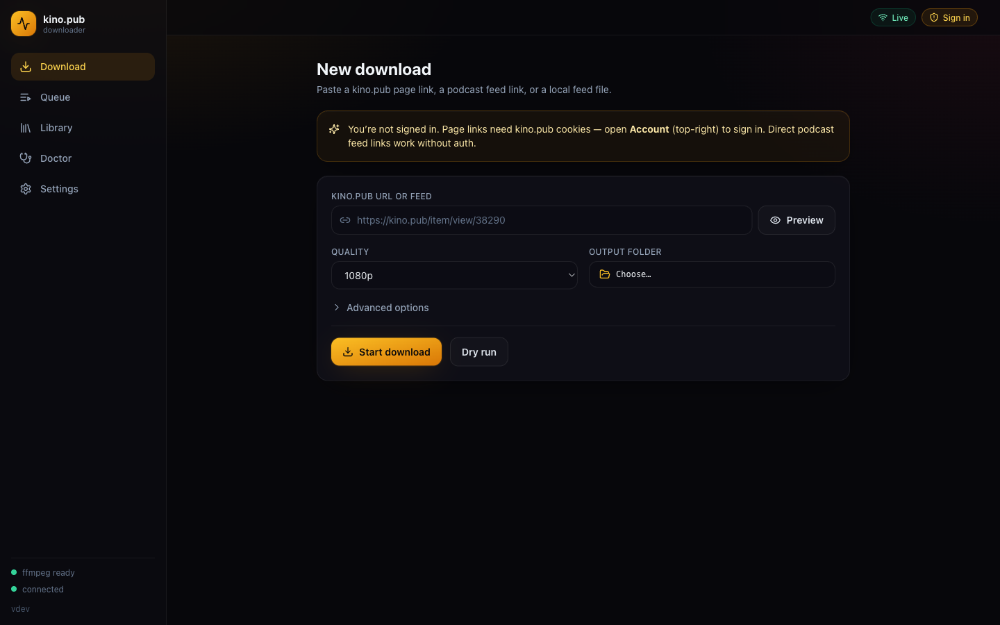
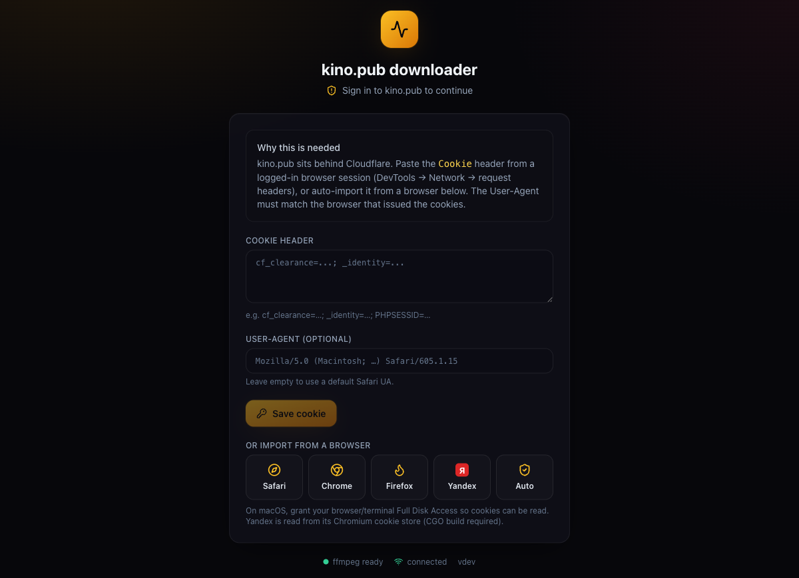
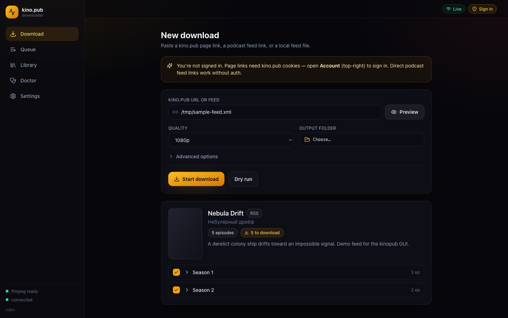
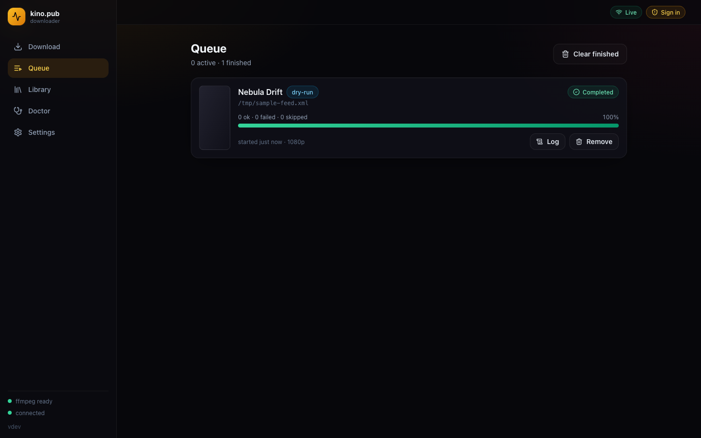
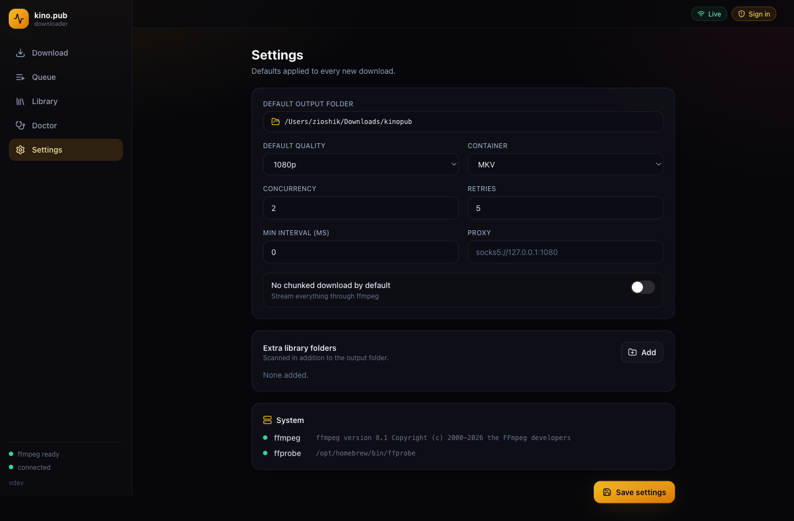

# kino.pub downloader · GUI

A polished, self-contained **desktop-grade web interface** for downloading full-fidelity video from [kino.pub](https://kino.pub) — every audio track, every subtitle, whole multi-season series — with live per-episode progress.

It is built **on top of** the excellent [`niazlv/kinopub-downloader`](https://github.com/niazlv/kinopub-downloader) Go engine: the GUI drives that engine's programmatic API directly, so you get real structured progress (speed, ETA, per-track bars) instead of scraped terminal output. Ship as **one binary** — a Go server with the React UI embedded (`go:embed`) — run it and a browser tab opens. No Electron, no Node at runtime.

<p align="center">
  
</p>

<p align="center">
  
  
  
  
  
</p>

---

## Highlights

- 🎬 **Cinematic dark UI** — series posters, live progress cards, nested per-track bars, smooth and dense.
- ⚡ **Real-time progress over SSE** — per-episode and per-audio-track percentage, download speed, ETA, byte/segment counts, and the engine's smart deferred-retry state, all live.
- 🧭 **Series browser** — paste a link, hit *Preview*, and get the full season/episode tree with "already downloaded" badges before committing.
- 🔊 **Interactive audio picker** — the `--audio-menu` experience as a proper modal: choose dubs/languages to keep, generalized across episodes.
- 🩺 **Doctor** — verify downloads against the state file and repair inconsistencies, with a readable report.
- 📚 **Library** — browse what you've already downloaded, with sizes, resolutions and missing-file detection.
- 🔐 **Auth made easy** — sign in once (paste a Cookie header or auto-import from Safari / Chrome / Firefox / **Yandex**); credentials are stored encrypted and machine-bound by the engine. Local features (Library, Doctor, Settings) work without signing in — only kino.pub page links need cookies.
- 📂 **Open downloads** — open a finished file or reveal its folder straight from the Library.
- 🧩 **Full CLI parity** — quality, container, season/episode selection, audio filters, proxy (HTTP/HTTPS/SOCKS5), concurrency, retries, throttling, `--no-chunked`, custom ffmpeg args, local feed files.
- 🌍 **Bilingual** — English & Russian, switchable in one click (remembered between sessions).
- 📦 **Single binary** — the UI is embedded; the original `kinopub` CLI is still here too.

## Screenshots

| Sign-in | Series browser (preview) |
| --- | --- |
|  |  |

| Live queue | Settings |
| --- | --- |
|  |  |

---

## Requirements

- **ffmpeg** on your `PATH` (used to mux video + audio + subtitles). The UI shows a green/red indicator for `ffmpeg` and `ffprobe`.
  ```bash
  brew install ffmpeg          # macOS
  sudo apt install ffmpeg      # Debian/Ubuntu
  ```
  ```powershell
  winget install Gyan.FFmpeg   # Windows (or: choco install ffmpeg / scoop install ffmpeg)
  ```
  On Windows, make sure `ffmpeg.exe` and `ffprobe.exe` are on your `PATH` (the package managers above do this) — the Settings page confirms both are found.
- A modern browser (the app opens in your default one).

## Install & run

### Option A — download a release binary

Grab `kinopub-gui-*` for your platform from the releases page, then run it:

```bash
chmod +x kinopub-gui-darwin-arm64
./kinopub-gui-darwin-arm64
# → opens http://127.0.0.1:8765 in your browser
```

On **Windows**, unzip `kinopub-gui-windows-amd64.zip` and run the executable (double-click or from a terminal):

```powershell
.\kinopub-gui-windows-amd64.exe
# → opens http://127.0.0.1:8765 in your browser
```

> The binary is unsigned, so SmartScreen may warn on first run — choose **More info → Run anyway**. Windows Firewall may also prompt; the server only listens on loopback, so allowing private-network access is enough. Credentials are stored encrypted at `%USERPROFILE%\.config\kinopub\credentials.enc`.

### Option B — build from source

You need Go 1.26+ and Node 20+ (only to build the UI; not at runtime).

```bash
git clone <this-repo>
cd kinopub-downloader
make run          # builds the web UI, builds the GUI binary, and launches it
```

Or step by step:

```bash
make web          # build the React frontend into web/dist (embedded via go:embed)
make gui          # build the ./kinopub-gui binary
./kinopub-gui
```

> **Distribution:** use the prebuilt release binaries above or `make`. `go install` is not the supported path — the Go module path still mirrors the upstream engine (`github.com/niazlv/kinopub-downloader`), so `go install …@latest` would resolve to upstream rather than this fork. A plain `go build ./cmd/kinopub-gui` needs `web/dist` present (it's committed, and `make web` regenerates it).

### Flags

```
kinopub-gui [flags]
  -addr      address to listen on (default 127.0.0.1:8765;
             falls back to an ephemeral port if taken)
  -no-open   do not open the browser automatically
  -version   print version and exit
```

The server binds to `127.0.0.1` only — it is a local control panel, not a public service.

### Updating

Release binaries self-update: **Settings → Software update** shows the current
version and, when a newer GitHub release exists, a **Update & restart** button.
It downloads the binary for your platform, verifies its SHA-256 against the
release `checksums.txt`, replaces the running executable in place, and restarts —
the open browser tab reconnects automatically. (Builds from source report as
`dev` and don't self-update; rebuild with `make`.)

---

## Using it

### 1. Sign in (for kino.pub page links)

Local features — **Library, Doctor, Settings, the folder picker** — work without signing in. Only kino.pub **page links** (`/item/view/…`) need cookies, because the site sits behind Cloudflare (podcast feeds and local feed files don't). To sign in, click **Sign in** (top-right) and either:

- **Paste a Cookie header** — in your browser open DevTools → Network → click a request → copy the `Cookie` header (and the `User-Agent`), or
- **Import from a browser** — Safari / Chrome / Firefox / **Yandex** / Auto (on macOS, allow Keychain access when prompted for Chromium-based browsers, or grant Full Disk Access for Safari).

> **User-Agent matters.** `cf_clearance` is bound to the exact User-Agent that solved Cloudflare's challenge. The sign-in form is pre-filled with the User-Agent of the browser you're viewing the app in — so the simplest reliable setup is to **open this app in the same browser you import cookies from** (e.g. open the URL in Yandex, then import Yandex). Otherwise paste both Cookie and User-Agent from that browser's DevTools.

> Credentials are encrypted with AES-256-GCM, bound to your machine, and stored at `~/.config/kinopub/credentials.enc` by the engine — the same store the CLI uses.

### 2. Download

Paste a URL and click **Preview** to inspect the series, tick the seasons you want, then **Start download**. Live progress appears under **Queue** — overall, per-episode, and (for HLS sources) per audio/video track, with speed and ETA.

> **kino.pub is often unavailable without a VPN.** If preview/downloads hang or time out, enable a VPN or set a proxy (Settings or Advanced options). The UI shows a reminder and detects timeouts.

### 3. Audio tracks

By default every audio track is kept. To keep only some:

- type a pattern in **Audio tracks** (e.g. `anilibria`, `!jpn`, `anilibria,!jpn` — `!`/`-` excludes), or
- enable **Interactive audio menu** and pick tracks in the modal when the download starts.

Matching is substring + language based and case-insensitive, so a dub labelled `01. Многоголосый. AniLibria (RUS)` in one episode and `02. AniLibria` in another both match `anilibria`. If a chosen dub is missing from some episode, the engine falls back to another track in the same language.

### 4. Doctor & Library

- **Doctor** verifies files against the state file (missing, truncated, duration-mismatch, orphan `.tmp`) and can repair them (`--fix`, `--clean-tmp`). It reuses the exact same resolution pipeline as a download, so duration checks compare against the real source.
- **Library** scans your output folders for `.kinopub-state.json` files and lists everything you've downloaded, flagging files that have gone missing on disk.

### 5. Settings

Defaults for new downloads (output folder, quality, container, concurrency, retries, throttle, proxy, no-chunked) plus extra folders to scan in the Library. Stored at `~/.config/kinopub/gui.json`.

---

## How it works

```
┌──────────────────────────────┐        SSE (live progress)        ┌───────────────────────┐
│  React + TS + Tailwind UI     │ ◀───────────────────────────────── │  Go HTTP server       │
│  (embedded via go:embed)      │ ──── REST (commands) ────────────▶ │  internal/gui         │
└──────────────────────────────┘                                    └───────────┬───────────┘
                                                                                 │ drives directly
                                                                     ┌───────────▼───────────┐
                                                                     │  kinopub engine        │
                                                                     │  internal/app/kinopub  │
                                                                     │  + services (HLS, feed,│
                                                                     │  downloader, doctor…)  │
                                                                     └────────────────────────┘
```

The GUI does **not** shell out to the CLI or parse its text. It implements the engine's own seams:

- a `domain.ProgressReporter` (plus the optional `ByteProgressSink` / `SegmentProgressSink` / `HLSProgressSink` and the `EpisodeDeferred` hook) that turns engine callbacks into SSE events;
- a `domain.AudioChooser` that surfaces the interactive picker to the browser and blocks until you answer;
- a `logx.Handler` that streams engine log lines into each job's log view.

This is why the progress, retries, audio fallback and doctor results are exactly what the CLI would produce — it's the same code path.

### Project layout

```
cmd/
  kinopub/          original CLI (unchanged)
  kinopub-gui/      GUI server entrypoint (embeds the UI, opens the browser)
internal/
  app/kinopub/      engine composition root (App.Run)        ← upstream
  domain/           ports & models                            ← upstream
  services/         feed, media, HLS, downloader, doctor, …   ← upstream
  gui/              REST + SSE server, job manager, GUI reporter/chooser
web/                React + Vite + Tailwind frontend
  dist/             built UI, embedded into the binary
```

## Development

```bash
# Terminal 1 — run the Go server (serves the embedded UI + API)
make gui && ./kinopub-gui

# Terminal 2 — hot-reloading frontend with API proxy to :8765
make dev            # → http://localhost:5173
```

`make vet` runs `go vet`, `make test` runs the engine's test suite.

## Credits

- Engine, CLI, and all the hard parts (HLS, feed parsing, retries, encrypted creds, doctor): **[niazlv/kinopub-downloader](https://github.com/niazlv/kinopub-downloader)**.
- Web interface (`cmd/kinopub-gui`, `internal/gui`, `web/`): this project.

## License

MIT — see [LICENSE](LICENSE). The upstream engine is MIT-licensed; this repository preserves that license and adds the GUI under the same terms.
